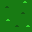
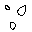
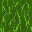
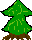
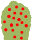
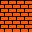

# TheLegendOfROOT

## Setup

### Apache

`httpd.conf`
```
Include <git root>/config/apache.macro
Use TheLegendOfROOT "<git root>"
UndefMacro TheLegendOfROOT
```

Required apache modules:
  * rewrite
  * macro

### Configuration

The class class.configuration.php stores the configuration object. It loads it's data from a config file - this file must exist and must be writable. To use the configuration object just do

$config = new Configuration("filePath...");
$config->setConfiguration("key", "value"); // The key nor the value must include a '=', otherwise it will not work. In the class the control char can be set (private $controlChar).
$config->saveConfiguration();

Access data from the configuration:
$config->getConfiguration("key");


## Dungeon JSON Format

Check out the [example JSON](dungeons/exampleDungeon.json).

### Entities
If `x` and `y` of the entity match with the current position (player steps on it)
the entity get triggered. Entities are executed in from the begin of
the list to the end.

```
{ // the player will spawn at the first entrance entity by default.
  "type": "entrance",
  "number": 1, // an entrance can have a number to be referenced by an exit
  "x": 0,
  "y": 14
},
{
  "type": "exit",
  "toDungeon": "cave", // reference to other dungeon. use filename without .json extension.
  "number": 1, // specify at which entrance the player should spawn. omit to use the default entrance.
  "x": 0,
  "y": 14
},
{
  "type": "message",
  "message": "Howdy!",
  "x": 1,
  "y": 2
},
{
  "type": "movePlayer", // the arrow block
  "direction": "left",
  "x": 2,
  "y": 2
}
```


### Terrain
The **x** and **y** root is at the top left corner. This way we can access the values with `terrain[y][x]`.

| `terrain` id | meaning    | passable   | note                | sprite                                       |
|:-------------|:-----------|:-----------|:--------------------|:---------------------------------------------|
| 0            | grass      | yes        |                     |      |
| 1            | rock       | no         |                     |       |
| 2            | water      | no (boat?) |                     |      |
| 3            | bridge     | yes        |                     |     |
| 4            | tall grass | yes        | entities are hidden |  |
| 5            | road       | yes        |                     |       |
| 6            | sand       | yes        |                     |       |
| 7            | tree       | no         |                     |       |
| 8            | water2     | no         |                     |     |
| 9            | cave       | yes        |                     |       |
| 10           | bush       | no         |                     |       |
| 11           | tree2      | no         |                     |      |
| 12           | grass2     | yes        |                     |     |
| 13           | wall       | no         |                     |       |
| 14           | item       | yes        |                     |       |
| 15           | sand2      | yes        |                     |      |
